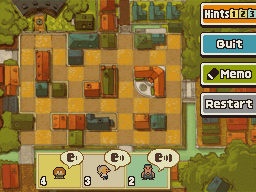
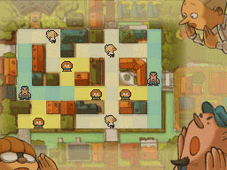

## The Evacuate Puzzle!

**Evacuate!** is a puzzle in *[Professor Layton and the Last Specter](https://layton.fandom.com/wiki/Professor_Layton_and_the_Last_Specter)*. The puzzle must be solved in order to progress the story.

You need to evacuate the neighborhood, and fast! Luckily, you were able to recruit nine friends to help you out:

- Two whose voices carry for 3 squares.
- Three whose voices carry for 2 squares
- Four whose voices carry for 1 square.

Where should you place each person so that the evacuation message reaches every square in the neighborhood.

Voices are carried parallel to the X and Y axis and doesn't flood. No two people shall stand in the same position.

